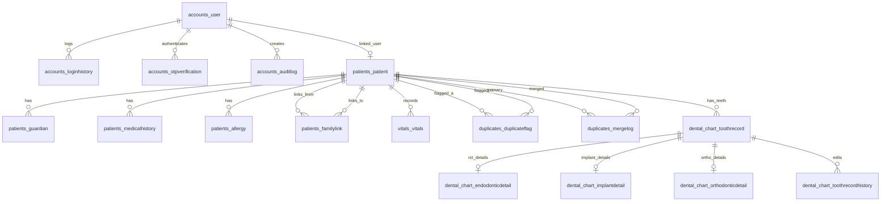

# Database Schema Specification & Documentation

**Project:** Dr. Chandrika Hospital Management Tool  
**Engine:** PostgreSQL 14+ / Standard SQL (Compatible with Django 6.0 ORM)  
**Database Name:** `dental_app_db`  
**Generated File:** [`schema.sql`](file:///d:/Dev%20Project/backend/schema.sql)  

---

## 1. Overview & Architecture

The database architecture is designed for a multi-specialty dental hospital management system. It comprises **22 database tables** organized across 5 primary application domains alongside Django's core authentication and session system.

### Domain Modules

```
                    ┌─────────────────────────┐
                    │      accounts_user      │ (Custom User Model)
                    └────────────┬────────────┘
                                 │
     ┌───────────────────────────┼───────────────────────────┐
     │ 1:1                       │ 1:N                       │ 1:N
┌────▼─────────────┐   ┌─────────▼─────────┐       ┌─────────▼─────────┐
│ patients_patient │   │ accounts_auditlog │       │accounts_loginhist │
└────┬─────────────┘   └───────────────────┘       └───────────────────┘
     │
     ├───────────────────────┬───────────────────────┬───────────────────────┐
     │ 1:N                   │ 1:N                   │ 1:N                   │ 1:N
┌────▼──────────┐   ┌────────▼─────────┐   ┌─────────▼────────┐    ┌─────────▼─────────┐
│ vitals_vitals │   │patients_guardian │   │patients_medhist  │    │ patients_allergy  │
└───────────────┘   └──────────────────┘   └──────────────────┘    └───────────────────┘
     │
     ├───────────────────────────────────────────────┐
     │ 1:N                                           │ 1:N / 1:1
┌────▼─────────────────────┐              ┌──────────▼─────────────────┐
│duplicates_duplicateflag  │              │ dental_chart_toothrecord   │
└──────────────────────────┘              └──────────┬─────────────────┘
                                                     │
                                       ┌─────────────┼─────────────┐
                                       │ 1:1         │ 1:1         │ 1:1
                                  ┌────▼─────┐  ┌────▼─────┐  ┌────▼─────┐
                                  │Endodontic│  │ Implant  │  │Ortho     │
                                  └──────────┘  └──────────┘  └──────────┘
```

---

## 2. Entity Relationship Diagram (ERD)



---

## 3. Schema Specification by Application

### Module 1: Accounts & Security (`accounts`)

#### Table: `accounts_user`
*Central user table supporting doctors, assistants, receptionists, accountants, and patients.*

| Column | Type | Constraints | Default | Description |
| :--- | :--- | :--- | :--- | :--- |
| `id` | `BIGINT` | `PRIMARY KEY`, `IDENTITY` | — | Auto-incrementing primary key |
| `password` | `VARCHAR(128)` | `NOT NULL` | — | Hashed user password |
| `last_login` | `TIMESTAMPTZ` | `NULL` | — | Timestamp of last successful login |
| `is_superuser` | `BOOLEAN` | `NOT NULL` | `FALSE` | Admin superuser privileges |
| `username` | `VARCHAR(150)` | `NOT NULL`, `UNIQUE` | — | System username |
| `first_name` | `VARCHAR(150)` | `NOT NULL` | — | User first name |
| `last_name` | `VARCHAR(150)` | `NOT NULL` | — | User last name |
| `email` | `VARCHAR(254)` | `NOT NULL` | — | User email address |
| `is_staff` | `BOOLEAN` | `NOT NULL` | `FALSE` | Django admin panel access flag |
| `is_active` | `BOOLEAN` | `NOT NULL` | `TRUE` | User account active state |
| `date_joined` | `TIMESTAMPTZ` | `NOT NULL` | `CURRENT_TIMESTAMP` | Date user was created |
| `role` | `VARCHAR(20)` | `NOT NULL`, `CHECK` | — | Role: `chief_doctor`, `doctor`, `assistant`, `receptionist`, `accountant`, `patient` |
| `phone` | `VARCHAR(15)` | `NULL`, `UNIQUE` | — | Phone number |
| `photo` | `VARCHAR(100)` | `NULL` | — | Profile picture storage path |
| `status` | `VARCHAR(10)` | `NOT NULL`, `CHECK` | `'active'` | Status: `active`, `inactive` |
| `mfa_enabled` | `BOOLEAN` | `NOT NULL` | `FALSE` | Multi-Factor Authentication enabled |
| `biometric_enabled` | `BOOLEAN` | `NOT NULL` | `FALSE` | Biometric auth enabled |
| `created_at` | `TIMESTAMPTZ` | `NOT NULL` | `CURRENT_TIMESTAMP` | Record creation timestamp |
| `updated_at` | `TIMESTAMPTZ` | `NOT NULL` | `CURRENT_TIMESTAMP` | Record last updated timestamp |

#### Table: `accounts_loginhistory`
| Column | Type | Constraints | Default | Description |
| :--- | :--- | :--- | :--- | :--- |
| `id` | `BIGINT` | `PRIMARY KEY`, `IDENTITY` | — | Auto-incrementing primary key |
| `user_id` | `BIGINT` | `FK -> accounts_user(id)`, `ON DELETE CASCADE` | — | Referenced user |
| `ip_address` | `INET` / `VARCHAR(39)` | `NULL` | — | Client IP address |
| `device_info` | `VARCHAR(255)` | `NULL` | — | Browser / device user-agent |
| `login_at` | `TIMESTAMPTZ` | `NOT NULL` | `CURRENT_TIMESTAMP` | Session start time |
| `logout_at` | `TIMESTAMPTZ` | `NULL` | — | Session end time |
| `status` | `VARCHAR(20)` | `NOT NULL` | `'success'` | Session outcome (e.g. success, failed) |

#### Table: `accounts_otpverification`
| Column | Type | Constraints | Default | Description |
| :--- | :--- | :--- | :--- | :--- |
| `id` | `BIGINT` | `PRIMARY KEY`, `IDENTITY` | — | Primary key |
| `user_id` | `BIGINT` | `FK -> accounts_user(id)`, `ON DELETE CASCADE` | — | Referenced user |
| `otp_code` | `VARCHAR(6)` | `NOT NULL` | — | 6-digit numeric OTP code |
| `purpose` | `VARCHAR(50)` | `NOT NULL` | — | Purpose: `login`, `password_reset`, `sensitive_action` |
| `expires_at` | `TIMESTAMPTZ` | `NOT NULL` | — | OTP expiration timestamp |
| `verified` | `BOOLEAN` | `NOT NULL` | `FALSE` | OTP verification flag |
| `created_at` | `TIMESTAMPTZ` | `NOT NULL` | `CURRENT_TIMESTAMP` | Generation timestamp |

#### Table: `accounts_auditlog`
| Column | Type | Constraints | Default | Description |
| :--- | :--- | :--- | :--- | :--- |
| `id` | `BIGINT` | `PRIMARY KEY`, `IDENTITY` | — | Primary key |
| `user_id` | `BIGINT` | `FK -> accounts_user(id)`, `ON DELETE SET NULL` | — | Actor who performed action |
| `action` | `VARCHAR(50)` | `NOT NULL` | — | Action: `create`, `update`, `delete`, `view` |
| `module` | `VARCHAR(50)` | `NOT NULL` | — | Targeted domain module (e.g. `patient`, `vitals`) |
| `record_id` | `VARCHAR(50)` | `NULL` | — | Targeted record identifier |
| `old_value` | `JSONB` | `NULL` | — | State before change |
| `new_value` | `JSONB` | `NULL` | — | State after change |
| `timestamp` | `TIMESTAMPTZ` | `NOT NULL` | `CURRENT_TIMESTAMP` | Audit log timestamp |

---

### Module 2: Patients Management (`patients`)

#### Table: `patients_patient`
| Column | Type | Constraints | Default | Description |
| :--- | :--- | :--- | :--- | :--- |
| `id` | `BIGINT` | `PRIMARY KEY`, `IDENTITY` | — | Primary key |
| `patient_code` | `VARCHAR(20)` | `NOT NULL`, `UNIQUE` | — | Generated code (e.g. `PT00001`) |
| `first_name` | `VARCHAR(100)` | `NOT NULL` | — | Patient first name |
| `last_name` | `VARCHAR(100)` | `NOT NULL` | `''` | Patient last name |
| `dob` | `DATE` | `NULL` | — | Date of birth |
| `gender` | `VARCHAR(10)` | `CHECK` | `''` | Gender: `male`, `female`, `other` |
| `phone` | `VARCHAR(15)` | `NULL`, `UNIQUE` | — | Unique contact number |
| `email` | `VARCHAR(254)` | `NULL` | — | Email address |
| `address` | `TEXT` | `NOT NULL` | `''` | Residential address |
| `city` | `VARCHAR(100)` | `NOT NULL` | `''` | City |
| `state` | `VARCHAR(100)` | `NOT NULL` | `''` | State |
| `country` | `VARCHAR(100)` | `NOT NULL` | `'India'` | Country |
| `preferred_language`| `VARCHAR(50)` | `NOT NULL` | `''` | Preferred communication language |
| `photo` | `VARCHAR(100)` | `NULL` | — | Patient photo path |
| `emergency_contact_name`| `VARCHAR(100)`| `NOT NULL` | `''` | Emergency contact name |
| `emergency_contact_phone`| `VARCHAR(15)`| `NOT NULL` | `''` | Emergency contact phone |
| `referral_source` | `VARCHAR(100)`| `NOT NULL` | `''` | How patient found clinic |
| `abha_id` | `VARCHAR(50)` | `NULL` | — | ABHA National Health ID |
| `linked_user_id` | `BIGINT` | `FK -> accounts_user(id)`, `UNIQUE`, `NULL` | — | Linked patient portal user account |
| `registered_by_id`| `BIGINT` | `FK -> accounts_user(id)`, `NULL` | — | Staff member who registered patient |
| `status` | `VARCHAR(10)` | `NOT NULL`, `CHECK` | `'active'` | Status: `active`, `inactive`, `merged` |
| `merged_into_id` | `BIGINT` | `FK -> patients_patient(id)`, `NULL` | — | Target patient record if merged |
| `created_at` | `TIMESTAMPTZ` | `NOT NULL` | `CURRENT_TIMESTAMP` | Registration date |
| `updated_at` | `TIMESTAMPTZ` | `NOT NULL` | `CURRENT_TIMESTAMP` | Last updated date |

#### Table: `patients_guardian`
| Column | Type | Constraints | Default | Description |
| :--- | :--- | :--- | :--- | :--- |
| `id` | `BIGINT` | `PRIMARY KEY`, `IDENTITY` | — | Primary key |
| `patient_id` | `BIGINT` | `FK -> patients_patient(id)`, `ON DELETE CASCADE` | — | Patient reference |
| `name` | `VARCHAR(100)` | `NOT NULL` | — | Guardian name |
| `relationship` | `VARCHAR(50)` | `NOT NULL` | — | Relationship (e.g. Parent, Spouse) |
| `phone` | `VARCHAR(15)` | `NOT NULL` | `''` | Guardian phone |
| `id_proof_type` | `VARCHAR(50)` | `NOT NULL` | `''` | Type of ID proof (e.g. Aadhaar, Passport) |
| `id_proof_number` | `VARCHAR(50)` | `NOT NULL` | `''` | Identification number |

#### Table: `patients_medicalhistory`
| Column | Type | Constraints | Default | Description |
| :--- | :--- | :--- | :--- | :--- |
| `id` | `BIGINT` | `PRIMARY KEY`, `IDENTITY` | — | Primary key |
| `patient_id` | `BIGINT` | `FK -> patients_patient(id)`, `ON DELETE CASCADE` | — | Patient reference |
| `condition_name` | `VARCHAR(150)` | `NOT NULL` | — | Medical condition (e.g. Hypertension, Diabetes) |
| `diagnosed_date` | `DATE` | `NULL` | — | Date of diagnosis |
| `notes` | `TEXT` | `NOT NULL` | `''` | Additional condition notes |
| `is_active` | `BOOLEAN` | `NOT NULL` | `TRUE` | Currently active condition flag |
| `recorded_by_id` | `BIGINT` | `FK -> accounts_user(id)`, `NULL` | — | Staff user recording condition |
| `created_at` | `TIMESTAMPTZ` | `NOT NULL` | `CURRENT_TIMESTAMP` | Record timestamp |

#### Table: `patients_allergy`
| Column | Type | Constraints | Default | Description |
| :--- | :--- | :--- | :--- | :--- |
| `id` | `BIGINT` | `PRIMARY KEY`, `IDENTITY` | — | Primary key |
| `patient_id` | `BIGINT` | `FK -> patients_patient(id)`, `ON DELETE CASCADE` | — | Patient reference |
| `allergen` | `VARCHAR(150)` | `NOT NULL` | — | Substance causing allergy (e.g. Penicillin, Latex) |
| `reaction` | `VARCHAR(255)` | `NOT NULL` | `''` | Observed reaction |
| `severity` | `VARCHAR(10)` | `NOT NULL`, `CHECK` | `'mild'` | Severity: `mild`, `moderate`, `severe` |
| `recorded_by_id` | `BIGINT` | `FK -> accounts_user(id)`, `NULL` | — | Staff user recording allergy |

#### Table: `patients_familylink`
| Column | Type | Constraints | Default | Description |
| :--- | :--- | :--- | :--- | :--- |
| `id` | `BIGINT` | `PRIMARY KEY`, `IDENTITY` | — | Primary key |
| `patient_id` | `BIGINT` | `FK -> patients_patient(id)`, `ON DELETE CASCADE` | — | Primary patient |
| `related_patient_id` | `BIGINT` | `FK -> patients_patient(id)`, `ON DELETE CASCADE` | — | Related patient profile |
| `relationship` | `VARCHAR(50)` | `NOT NULL` | — | Family relationship (e.g. Child, Sibling) |

---

### Module 3: Clinical Vitals (`vitals`)

#### Table: `vitals_vitals`
| Column | Type | Constraints | Default | Description |
| :--- | :--- | :--- | :--- | :--- |
| `id` | `BIGINT` | `PRIMARY KEY`, `IDENTITY` | — | Primary key |
| `patient_id` | `BIGINT` | `FK -> patients_patient(id)`, `ON DELETE CASCADE` | — | Patient reference |
| `context` | `VARCHAR(20)` | `NOT NULL`, `CHECK` | — | Context: `registration`, `pre_treatment`, `intra_procedure`, `post_treatment` |
| `bp_systolic` | `INTEGER` | `NULL`, `CHECK (>= 0)` | — | Systolic blood pressure (mmHg) |
| `bp_diastolic` | `INTEGER` | `NULL`, `CHECK (>= 0)` | — | Diastolic blood pressure (mmHg) |
| `pulse` | `INTEGER` | `NULL`, `CHECK (>= 0)` | — | Heart rate (bpm) |
| `blood_sugar` | `INTEGER` | `NULL`, `CHECK (>= 0)` | — | Blood glucose level (mg/dL) |
| `temperature` | `NUMERIC(4,1)`| `NULL` | — | Body temperature (°F) |
| `spo2` | `INTEGER` | `NULL`, `CHECK (0-100)`| — | Blood oxygen saturation level (%) |
| `weight_kg` | `NUMERIC(5,2)`| `NULL` | — | Patient weight in kilograms |
| `height_cm` | `NUMERIC(5,2)`| `NULL` | — | Patient height in centimeters |
| `notes` | `TEXT` | `NOT NULL` | `''` | Clinical observations |
| `is_flagged` | `BOOLEAN` | `NOT NULL` | `FALSE` | Automated risk alert flag |
| `flagged_reason` | `VARCHAR(255)`| `NOT NULL` | `''` | Reason for flag (e.g. BP Systolic high) |
| `recorded_by_id` | `BIGINT` | `FK -> accounts_user(id)`, `NULL` | — | Staff member who recorded vitals |
| `recorded_at` | `TIMESTAMPTZ` | `NOT NULL` | `CURRENT_TIMESTAMP` | Measurement timestamp |

---

### Module 4: Duplicate Flagging & Merging (`duplicates`)

#### Table: `duplicates_duplicateflag`
| Column | Type | Constraints | Default | Description |
| :--- | :--- | :--- | :--- | :--- |
| `id` | `BIGINT` | `PRIMARY KEY`, `IDENTITY` | — | Primary key |
| `patient_a_id` | `BIGINT` | `FK -> patients_patient(id)`, `ON DELETE CASCADE` | — | First patient profile |
| `patient_b_id` | `BIGINT` | `FK -> patients_patient(id)`, `ON DELETE CASCADE` | — | Candidate duplicate patient profile |
| `match_score` | `NUMERIC(5,2)`| `NOT NULL`, `CHECK (0-100)` | — | Calculated similarity percentage score |
| `matched_fields` | `JSONB` | `NOT NULL` | `'{}'` | Matched fields breakdown (e.g. `{"phone": true}`) |
| `status` | `VARCHAR(10)` | `NOT NULL`, `CHECK` | `'pending'` | Status: `pending`, `dismissed`, `merged` |
| `flagged_by_id` | `BIGINT` | `FK -> accounts_user(id)`, `NULL` | — | Null if automatically flagged by AI/system |
| `flagged_at` | `TIMESTAMPTZ` | `NOT NULL` | `CURRENT_TIMESTAMP` | Flag generation time |
| `reviewed_by_id` | `BIGINT` | `FK -> accounts_user(id)`, `NULL` | — | Staff member who reviewed flag |
| `reviewed_at` | `TIMESTAMPTZ` | `NULL` | — | Review completion time |

*Constraint:* `UNIQUE(patient_a_id, patient_b_id)` prevents duplicate pair records.

#### Table: `duplicates_mergelog`
| Column | Type | Constraints | Default | Description |
| :--- | :--- | :--- | :--- | :--- |
| `id` | `BIGINT` | `PRIMARY KEY`, `IDENTITY` | — | Primary key |
| `primary_patient_id` | `BIGINT` | `FK -> patients_patient(id)`, `ON DELETE CASCADE` | — | Target retained profile |
| `merged_patient_id` | `BIGINT` | `FK -> patients_patient(id)`, `ON DELETE CASCADE` | — | Absorbed profile |
| `field_resolutions` | `JSONB` | `NOT NULL` | `'{}'` | Key-value resolutions of conflicting fields |
| `merged_at` | `TIMESTAMPTZ` | `NOT NULL` | `CURRENT_TIMESTAMP` | Merge timestamp |
| `reversible_until` | `TIMESTAMPTZ` | `NOT NULL` | — | Rollback expiration window |
| `reversed` | `BOOLEAN` | `NOT NULL` | `FALSE` | True if merge was undone |
| `merged_by_id` | `BIGINT` | `FK -> accounts_user(id)`, `ON DELETE PROTECT` | — | User who executed merge |

---

### Module 5: Dental Charting (`dental_chart`)

#### Table: `dental_chart_toothrecord`
| Column | Type | Constraints | Default | Description |
| :--- | :--- | :--- | :--- | :--- |
| `id` | `BIGINT` | `PRIMARY KEY`, `IDENTITY` | — | Primary key |
| `patient_id` | `BIGINT` | `FK -> patients_patient(id)`, `ON DELETE CASCADE` | — | Patient reference |
| `dentition_type` | `VARCHAR(10)` | `NOT NULL`, `CHECK` | `'adult'` | Dentition: `adult` (permanent), `primary` (milk) |
| `tooth_number` | `VARCHAR(5)` | `NOT NULL` | — | FDI notation string (e.g. `"11"`, `"36"`, `"85"`) |
| `surface` | `VARCHAR(10)` | `NOT NULL`, `CHECK` | `'whole'` | Surface: `mesial`, `distal`, `occlusal`, `buccal`, `lingual`, `incisal`, `whole` |
| `condition` | `VARCHAR(20)` | `NOT NULL`, `CHECK` | — | Diagnosis: `decay`, `filling`, `crown`, `bridge`, `implant`, `rct`, `missing`, `impacted`, `unerupted`, `supernumerary`, `fracture`, `mobility`, `sensitivity`, `healthy` |
| `status` | `VARCHAR(10)` | `NOT NULL`, `CHECK` | `'existing'` | Treatment Status: `existing`, `planned`, `completed`, `rejected` |
| `notes` | `TEXT` | `NOT NULL` | `''` | Clinical procedure notes |
| `recorded_by_id` | `BIGINT` | `FK -> accounts_user(id)`, `NULL` | — | Dentist/assistant who charted record |
| `recorded_at` | `TIMESTAMPTZ` | `NOT NULL` | `CURRENT_TIMESTAMP` | Charting timestamp |
| `updated_at` | `TIMESTAMPTZ` | `NOT NULL` | `CURRENT_TIMESTAMP` | Last updated timestamp |

#### Table: `dental_chart_endodonticdetail`
| Column | Type | Constraints | Default | Description |
| :--- | :--- | :--- | :--- | :--- |
| `id` | `BIGINT` | `PRIMARY KEY`, `IDENTITY` | — | Primary key |
| `tooth_record_id` | `BIGINT` | `FK -> toothrecord(id)`, `UNIQUE`, `ON DELETE CASCADE` | — | 1:1 link to ToothRecord |
| `working_length_mm`| `NUMERIC(4,1)`| `NULL` | — | Canal working length in mm |
| `canal_count` | `SMALLINT` | `NULL`, `CHECK (>= 0)` | — | Number of root canals treated |
| `obturation_date` | `DATE` | `NULL` | — | Date of canal obturation |
| `technique_notes` | `TEXT` | `NOT NULL` | `''` | Obturation technique & sealant notes |

#### Table: `dental_chart_implantdetail`
| Column | Type | Constraints | Default | Description |
| :--- | :--- | :--- | :--- | :--- |
| `id` | `BIGINT` | `PRIMARY KEY`, `IDENTITY` | — | Primary key |
| `tooth_record_id` | `BIGINT` | `FK -> toothrecord(id)`, `UNIQUE`, `ON DELETE CASCADE` | — | 1:1 link to ToothRecord |
| `brand` | `VARCHAR(100)` | `NOT NULL` | `''` | Implant manufacturer (e.g. Straumann, Nobel) |
| `diameter_mm` | `NUMERIC(4,2)`| `NULL` | — | Implant diameter in mm |
| `length_mm` | `NUMERIC(4,2)`| `NULL` | — | Implant length in mm |
| `batch_number` | `VARCHAR(100)`| `NOT NULL` | `''` | Lot / batch number |
| `serial_number` | `VARCHAR(100)`| `NOT NULL` | `''` | Implant unique serial number |
| `placement_date` | `DATE` | `NULL` | — | Date of surgical placement |
| `bone_graft_material`| `VARCHAR(150)`| `NOT NULL` | `''` | Graft material used |
| `expiry_date` | `DATE` | `NULL` | — | Component expiration date |
| `warranty_months` | `SMALLINT` | `NULL`, `CHECK (>= 0)` | — | Warranty coverage in months |

#### Table: `dental_chart_orthodonticdetail`
| Column | Type | Constraints | Default | Description |
| :--- | :--- | :--- | :--- | :--- |
| `id` | `BIGINT` | `PRIMARY KEY`, `IDENTITY` | — | Primary key |
| `tooth_record_id` | `BIGINT` | `FK -> toothrecord(id)`, `UNIQUE`, `ON DELETE CASCADE` | — | 1:1 link to ToothRecord |
| `appliance_type` | `VARCHAR(100)`| `NOT NULL` | `''` | Appliance type (e.g. Metal Brackets, Aligners) |
| `bracket_type` | `VARCHAR(100)`| `NOT NULL` | `''` | Bracket slot specification |
| `wire_size` | `VARCHAR(50)` | `NOT NULL` | `''` | Archwire material & size (e.g. 0.016 NiTi) |
| `position_notes` | `TEXT` | `NOT NULL` | `''` | Tooth position correction goals |
| `adjustment_date` | `DATE` | `NULL` | — | Wire tightening / adjustment date |

#### Table: `dental_chart_toothrecordhistory`
| Column | Type | Constraints | Default | Description |
| :--- | :--- | :--- | :--- | :--- |
| `id` | `BIGINT` | `PRIMARY KEY`, `IDENTITY` | — | Primary key |
| `tooth_record_id` | `BIGINT` | `FK -> toothrecord(id)`, `ON DELETE CASCADE` | — | Linked ToothRecord |
| `changed_field` | `VARCHAR(50)` | `NOT NULL` | — | Field modified (e.g. condition, status) |
| `old_value` | `VARCHAR(255)`| `NOT NULL` | `''` | Previous value |
| `new_value` | `VARCHAR(255)`| `NOT NULL` | `''` | Updated value |
| `changed_by_id` | `BIGINT` | `FK -> accounts_user(id)`, `NULL` | — | User who made modification |
| `changed_at` | `TIMESTAMPTZ` | `NOT NULL` | `CURRENT_TIMESTAMP` | Audit timestamp |

---

## 4. Execution & Setup Instructions

### Method A: Direct Execution of `schema.sql` on PostgreSQL

1. Open your terminal or PostgreSQL CLI (`psql`).
2. Create the target database:
   ```sql
   CREATE DATABASE dental_app_db WITH OWNER postgres ENCODING 'UTF8';
   ```
3. Execute the SQL DDL file:
   ```bash
   psql -U postgres -d dental_app_db -f backend/schema.sql
   ```

### Method B: Django ORM Migrations

1. Configure environment variables or database settings in [`settings.py`](file:///d:/Dev%20Project/backend/config/settings.py).
2. Execute migrations using Django's Virtual Environment:
   ```bash
   backend\venv\Scripts\python.exe backend/manage.py migrate
   ```
